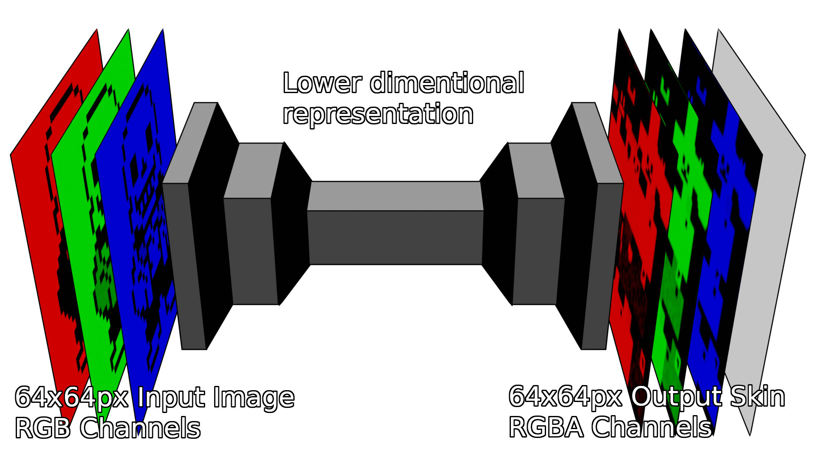
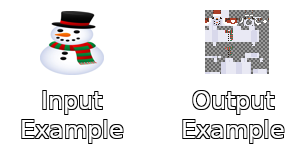
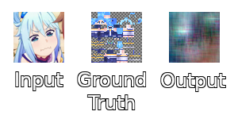
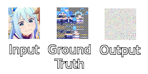
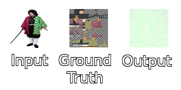
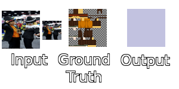

# Minecraft skin generator
A Minecraft skin generator using an autoencoder model.

## Introduction
This work attempts to generate Minecraft skins using an autoencoder model.  Autoencoders are known for being able to represent high dimentional data  in a lower dimensional space, which means that this model is able to compress  information using the most relevant features of a dataset.

This particular model was chosen with the hopes of it being able learn distinctive traits from pictures of real people as well as fictional characters and encode them into a smaller respresentation. This representation would then be decoded by a Minecraft skin generator.

## Implementation
A dataset with labeled pictures of real people and fictional characters with their corresponding Minecraft skin was needed, so the first step in the process was to collect a dataset. Many freely available datasets on the Internet were looked at but none of them matched the requirements for the type of model to be implemented, so a new dataset had to be constructed from scratch.

Around 650 images were collected with their corresponding Minecraft skins as labels. These images were saved as 64 by 64 pixels RGB PNG files in a directory called "input", while the minecraft skins were saved as RGBA PNG files in another directory called "output".

The experiments were run on a [google collab](https://colab.research.google.com) python notebook since it is free platform with a vast amount computational resources available and supports machine learning libraries such as keras and tensorflow by default. Training data was stored in a [google drive](https://drive.google.com) directory and fetched through google collabs with their API.

As far as the model pipeline goes, the only preprocessing done was making sure that the inputs were 64 by 64 pixels RGB images and also making sure that the labels were 64 by 64 pixels RGBA images. Data was fed into the model by listing all the files in the "input" and "output" directories and then matching all the input and output files with the same name.

After loading the names of the input and output files into a list, the list is then randomly shuffled and an iterator object is created from it. Once the iterator is generated, filenames can be consumed once at a time when needed. This provides a nice interface to stream data into the model.

The next step in the pipeline would be to perform data agumentation by scaling, cropping, saturating, hue shifting and adding noise to the input images. This was overlooked as a low priority component for the experiment so it was not implemented. This feature might prove to be too important to ignore given the size of the dataset so it will be added later in future development. 

In training the model consumes the input and output images in batches of fixed size, the batch size is a hyper parameter that needs to be set before running the experiment and many values were tried which gave different results. The batches are created by consuming the next N filenames from the iterator objectand then loading the all of those files into memory one batch at a time.

There were a lot of models trained in this experiment, all of them were convolutional neural networks (CNN). These kind of neural networks are very good at processing images but they have parameters that need to be set for each layer, those being the number of filters, kernel size, strides and padding. There is also a special kind of layer for CNNs called a max pooling layer but some authors say it is not very effective in autoencoders.

## Results

The first model had 6 convolutional layers and 2 max pooling layers for the encoder. As for the decoder, it had 6 convolutional layers and 2 upsampling layers, with no activation function for any of the layers. After training, the model had a good accuray score, but it was due to a bug in the code were the model was trying to learn the same input data as the output data, instead of learning to create Minecraft skins. This failed experment lead to believe that the model was actually learning some representation of the data it was trying to recreate, so it looked promising.

After fixing the bug and training the model with the correct labels, the results just got worse. The output of the model turned into noise and the neural network was not able to learn anything. There were some tweaks to the values of the batch size, epochs and the amount of filters on each layer but the results did not get any better.

Following some recommendations from Internet articles, the max pooling layers of the model were removed and the stride value of each layer was increased to compensate for this change. Batch normalization was added to each layer as well as a relu activation, finally a hyperbolic tangent activation was added to the last layer because it seems that it performs the best while doing these kinds of tasks.

With these parameters the model did better than before and some square patterns could be seen in the result, although they were unrelated to the label image. Most of the output was noise.

The last model tried did not have max pooling layers and removed both batch normalization and relu activation layers. In this experiment the output of the network was the same for every input. The size of input image was reduced in half to make it easier for the network to learn, but the results were the same in both scenarios so the problem is unlikely to be related to the size of the input image.

## Future work

It seems that the network might be able to learn a lower dimentional representation of the training images, but it is struggling to generate the Minecraft skins with this representation. This is likely due to the fact that the output image is bigger than the input image because it has an alpha channel and the input image does not have it.

The alpha channel can be dropped from the labels to reduce the output size and make the neural network easier to train. If needed, colors can be indexed to reduce the output size as well and this might improve the accuracy of the model.

Another option is to segment the different parts of the texture and make a model that outputs each one of them individually. This solution might also improve the accuracy of the model, but it would require a lot of preprocessing and time consuming image labeling.

A reason why the model might be failing is because the encoder and the decoder are trained in the same model at the same time. Some articles describe encoder models trained without the decoder and the other way around, so it might be a good idea to split them up and test if the accuracy of the overall model increases.